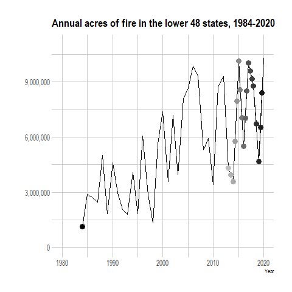

```{r global, include=FALSE}
# load data in 'global' chunk so it can be shared by all users of the dashboard
library(tigris)
library(dplyr)
library(leaflet)
library(tidyverse)
library(sf)
library(rgdal)
library(htmlwidgets)


# load data in 'global' chunk so it can be shared by all users of the dashboard
# Chord Diagram
library(chorddiag)
library(igraph)
library(readr)
library(tidygraph)

# read in data
histFireGVchord <- read_csv("data/histFireGVchord.csv")
# View(histFireGVchord)

#convert to matrix
histFireGVchordMatrix<-as.matrix(as_adjacency_matrix(as_tbl_graph(histFireGVchord),attr = "acres"))

#clean up matrix (could be cleaner!)
histFireGVchordMatrix = subset(histFireGVchordMatrix, select = -c(1:7))

histFireGVchordMatrix2 <- histFireGVchordMatrix[-c(8:10),]

```

Overview
=====================================

Column {data-width=800}
-----------------------------------------------------------------------


```{r, fig.height=4}
# insert choroMap.html URL
htmltools::tags$iframe(title = "My embedded document", src = "choroMapFW.html", frameborder = "1", width = "100%", height="700", vspace="30")

```

Column {.sidebar}
-----------------------------------------------------------------------

### There was ~172,000,000 acres of fire every year before European Colonization

Blah Blah

```{r}
# test
```


Fire and Ecosystems
=====================================

Column {data-width=900}
-----------------------------------------------------------------------

Which ecosystems had the most fire? And what kind?

```{r, fig.width=11, fig.height=7.5}
# Chord Diagram
#make a custom color pallet
groupColors <-c( "#e6e0be", # grassland OK
                 "#56bf5f", # hardwood OK
                 "#1d4220", # conifer OK
                 "#7db7c7", # riparian OK
                 "#397d3f", # hardwood-conifer OK
                 "#917e5c", # shrub
                 "#5e513a", # savana
                 "#fed98e", # surface
                 "#fe9929", # mixed
                 "#cc4c02") 
#make chord diagram
chord<-chorddiag(data = histFireGVchordMatrix2,
                 type = "bipartite",
                 groupColors = groupColors,
                 groupnamePadding = 10,
                 groupPadding = 3,
                 groupnameFontsize = 14,
                 showTicks = FALSE,
                 margin=125,
                 tooltipGroupConnector = "    &#x25B6;    ",
                 chordedgeColor = "#B3B6B7"
)
chord
```


Column {data-width=300}
-----------------------------------------------------------------------
blah


```{r}

knitr::include_graphics("groupVeg.jpg") 

```


Recent
=====================================

Column
-----------------------------------------------------------------------

Moving line graph

```{r}
# add animated.gif


```

Column {.sidebar}
-----------------------------------------------------------------------

### Explain here with minimal text

```{r}
# test
```


Then and now
=====================================

Column
-----------------------------------------------------------------------

States

```{r, fig}
# horizontal lollipop chart

htmltools::includeHTML("dumbbell.html")
```


Conversion
=====================================

Column
-----------------------------------------------------------------------

Historical conversion

```{r}
# SANKEY
```

Column {.tabset}
-------------------------------------
   
### Tab with text

```{r}
```   
 
### Tab with some sort of chart with amounts conversion
    
```{r}
```
