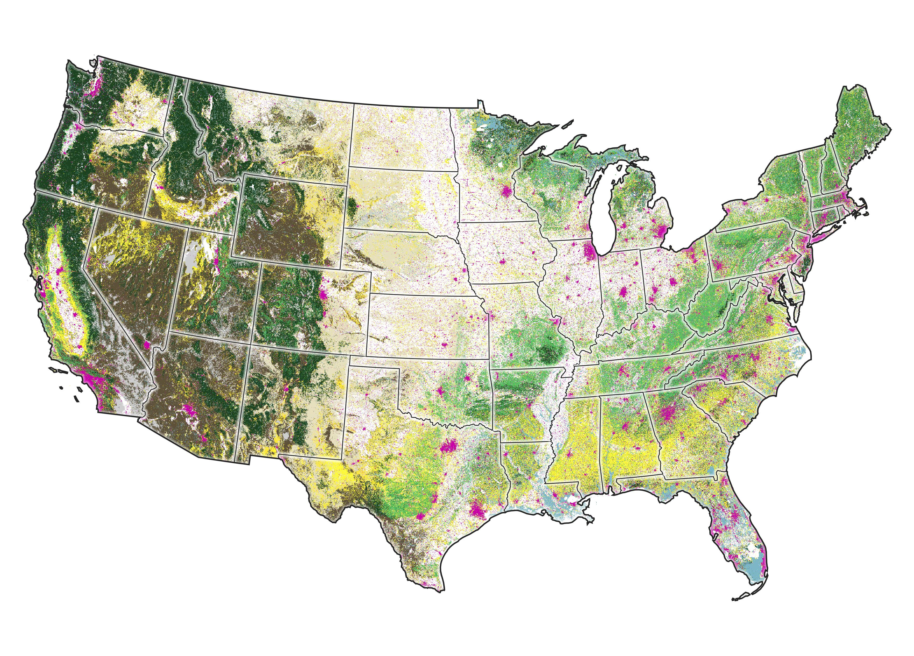

<style type="text/css"> .sidebar { overflow: auto; } </style>

    
    ```{r global, include=FALSE}
# load data in 'global' chunk so it can be shared by all users of the dashboard
library(tigris)
library(dplyr)
library(leaflet)
library(tidyverse)
library(sf)
library(rgdal)
library(htmlwidgets)


# load data in 'global' chunk so it can be shared by all users of the dashboard
# Chord Diagram
library(chorddiag)
library(igraph)
library(readr)
library(tidygraph)

# read in data
histFireGVchord <- read_csv("data/histFireGVchord.csv")
# View(histFireGVchord)

#convert to matrix
histFireGVchordMatrix<-as.matrix(as_adjacency_matrix(as_tbl_graph(histFireGVchord),attr = "acres"))

#clean up matrix (could be cleaner!)
histFireGVchordMatrix = subset(histFireGVchordMatrix, select = -c(1:7))

histFireGVchordMatrix2 <- histFireGVchordMatrix[-c(8:10),]
```

Fire in the lower 48 states
========================================================

## Fire amounts and severity by state


```{r choropleth, fig.height=7}
# insert choroMap.html URL
htmltools::tags$iframe(title = "My embedded document", src = "choroMapFW.html", frameborder = "1", width = "100%", height="700", vspace="30")

```


Column {.sidebar}
-----------------------------------------------------------------------

### <b><font  size="4em" color="#000000">There was ~172,000,000 acres of fire annually prior to European colonization</font></b>   

Prior to European colonization most of the fires were located in the central and eastern regions, and were most common in the grassland ecosystems, where replacement fires could have happened every 1-3 years.  The pine, oak and hickory forests of the east (especially the longleaf pine ecosystems of the southeast) would typically have surface fires every 5-10 years, with replacement fires being rare. 

Out west, where we see the most fires today, the forested ecosystems would have had fairly frequent fires. Those states had less fire overall due to the heterogeneity of ecosystems: that is, most of those states had a mix of fire-dependent and fire-independent ecosystems. 

Please note that ranges shift based on the fire type selected.

// Celeste here: fixed a bit of grammar/ spellcheck in the paragraphs above. My main thoughts are: should we define replacement fire? The second paragraph also seems contradictory because it says there was frequent fire, then says it had less fire. Compared to the present? Could make that more clear. Also might change 'could have happened' in the first sentence to something more concrete, even just 'would have happened.' 
// Celeste: Maybe move the 'please note that the ranges shift' over on top of the map key, if possible? People will likely not read it buried at the end here.

Fire and Ecosystems
=========================================================

### <b><font  size="4em" color="#000000">Where the ecosystems were</font></b> 


```{r groupveg map, fig.height=7, fig.width=10}
knitr::include_graphics("groupVegLegend.png") 
```
// Celeste: maybe set the map view more zoomed in. also, the key explanation could be moved to the top.

### <b><font  size="4em" color="#000000">How much fire was in each type?</font></b>  
    
```{r chord, fig.height=7.5, fig.width=11}


# Chord Diagram
#make a custom color pallet
groupColors <-c( "#e6e0be", # grassland OK
                 "#56bf5f", # hardwood OK
                 "#1d4220", # conifer OK
                 "#7db7c7", # riparian OK
                 "#397d3f", # hardwood-conifer OK
                 "#917e5c", # shrub
                 "#5e513a", # savana
                 "#fed98e", # surface
                 "#fe9929", # mixed
                 "#cc4c02") 
#make chord diagram
chord<-chorddiag(data = histFireGVchordMatrix2,
                 type = "bipartite",
                 groupColors = groupColors,
                 groupnamePadding = 10,
                 groupPadding = 3,
                 groupnameFontsize = 14,
                 showTicks = FALSE,
                 margin=125,
                 tooltipGroupConnector = "    &#x25B6;    ",
                 chordedgeColor = "#B3B6B7"
)
chord
```


### <b><font  size="4em" color="#000000">Most of the vegetation that would have had replacement fire historically has been converted to agriculture (white) or urban (pink) land uses, or have uncharacteristic vegetation (e.g., invasives or super dense forests).</font></b> 
// Celeste: I don't love the syntax of that sentence^ I think maybe the last 'have' should be 'has'? But also just generally the phrasing is confusing. 
/ Option: Most of the vegetation that historically had replacement fires has been converted to agriculture (white) or urban (pink) land uses, or it has uncharacteristic vegetation (e.g., invasives or super dense forests).
/ I also just generally am not sure if this is the place for that analysis? On the other two charts/ maps the titles were in bold up in that space.

```{r groupvegconversion map, fig.height=7, fig.width=10}
 
```


Column {.sidebar}
-----------------------------------------------------------------------

### <b><font  size="4em" color="#000000">Fire severity varied by ecosystem type</font></b>   
Ecosystems have varying levels of different fire types (aka severity; surface, mixed or replacement).  The map depicts historical locations of broad ecosystem groups.  

Scroll down to explore how fire type varies for different ecosystem groups.  Explore and note the patterns.  For example, hover over the outer segment labeled "Replacement" then trace the bands to discover that most replacement fires occurred in the grassland ecosystems. 

Continue scrolling to examine our broad vegetation groups today.  

// Celeste: It would make more sense to explain fire severity types on the first page. I don't think the user-guide ("explore and note patterns") is the most helpful. Map titles ("where the ecosystems were") could be better?
In the chord, if we're keeping it, it might be helpful to add commas into the values that you see when hovering, and maybe even round them into things like 22M, because they're hard to interpret as long strings of numbers.

Recent Fire
======================================================================

<br>
<br>

```{r animated current, fig.height=6, fig.width=6, fig.align='center'}
# add animated.gif
knitr::include_graphics("animated.gif")

```


Column {.sidebar}
-----------------------------------------------------------------------

### <b><font  size="4em" color="#000000">Increasing fire</font></b>   
It's no surprise that the amount of fires occurring today is generally increasing.  While far short of the ~172M acres that would have burned annually prior to European colonization, the amount of fire that is high-severity in ecosystems that would not had much of that fire type historically is increasing, and this number is not scaled to the current amount of natural vegetation.  


Past vs. Present {data-width=600}
========================================================================

Column {.sidebar}
-----------------------------------------------------------------------

### <b><font  size="4em" color="#000000">Fire by state</font></b>   

This chart summarizes fire past (yellow dots) and present (green dots) for the lower 48 states.  

/ Celeste: I think that is wrong ^?? The yellow dots, according to when you hover and also just what makes sense, should be the present. It could also use a bit more explanatory text. What are the two bold black vertical lines? 
/ This chart is organized alphabetically. Do we want to organize from greatest to least change, or regionally, or somehow significantly otherwise?

Column {data-size=900}
----------------------------------------------------------------

```{r dumbbell, fig.height=9, fig.width=10}
# horizontal lollipop chart

library(tidyverse)
library(scales)
library(extrafont)
library(ggplot2) 
library(ggalt)   
library(plotly)


currentFireAcresStates <- read_csv("data/currentFireAcresStates.csv")
#View(currentFireAcresStates)

histAreaBurnedbyState <- read_csv("data/histAreaBurnedbyState.csv")
#View(histAreaBurnedbyState)

historicalCurrentFire <- merge(currentFireAcresStates, histAreaBurnedbyState, by = "state")

historicalCurrentFire <- historicalCurrentFire %>%
  mutate(difference = historic_acres_burned - currentAverageAcres)


historicalCurrentFire$state <- factor(historicalCurrentFire$state , levels = rev(unique(historicalCurrentFire$state)))

write.csv(historicalCurrentFire, file = "historicalVScurrentDraft.csv")


# ggplot(historicalCurrentFire, aes(x=currentAverageAcres, xend=historic_acres_burned, y=state)) + 
#   #create a thick line between x and xend instead of using defaut 
#   #provided by geom_dubbell
#   geom_segment(aes(x=currentAverageAcres, 
#                    xend=historic_acres_burned, 
#                    y=state, 
#                    yend=state), 
#                color="#b2b2b2", size=1.5)+
#   geom_dumbbell(color="light blue", 
#                 size_x=4.0, 
#                 size_xend = 4.0,
#                 colour_x="#edae52", 
#                 colour_xend = "#9fb059")+
#   labs(x=NULL, y=NULL) +
#   theme_bw(base_size = 14, base_family = "Calisto MT") +
#   scale_x_continuous(label=comma)

##  take 2
# add mean lines

avgCur <- mean(historicalCurrentFire$currentAverageAcres)
avgHist <- mean(historicalCurrentFire$historic_acres_burned)


db <-
  ggplot(historicalCurrentFire, aes(x=currentAverageAcres, xend=historic_acres_burned, y=state)) + 
  #create a thick line between x and xend instead of using defaut 
  #provided by geom_dubbell
  geom_segment(aes(x=currentAverageAcres, 
                   xend=historic_acres_burned, 
                   y=state, 
                   yend=state), 
               color="#b2b2b2", size=1.5)+
  geom_dumbbell(color="light blue", 
                size_x=4.0, 
                size_xend = 4.0,
                colour_x="#edae52", 
                colour_xend = "#9fb059")+
  labs(x=NULL, y=NULL) +
  theme_bw(base_size = 14, base_family = "Calisto MT") +
  scale_x_continuous(label=comma) + 
  geom_vline(xintercept = avgCur) +
  geom_vline(xintercept = avgHist)


vlineCUR <- function(x = avgCur, color = "grey") {
  list(
    type = "line", 
    y0 = 0, 
    y1 = 1, 
    yref = "paper",
    x0 = x, 
    x1 = x, 
    line = list(color = color)
  )
}

vlineHIST <- function(x = avgHist, color = "grey") {
  list(
    type = "line", 
    y0 = 0, 
    y1 = 1, 
    yref = "paper",
    x0 = x, 
    x1 = x, 
    line = list(color = color)
  )
}


fig <- plot_ly(historicalCurrentFire, color = I("gray80"))
fig <- fig %>% add_segments(x = ~currentAverageAcres, xend = ~historic_acres_burned, y = ~state, yend = ~state, showlegend = FALSE)
fig <- fig %>% add_markers(x = ~currentAverageAcres, y = ~state, name = "Current", color = I("#edae52"), showlegend = FALSE)
fig <- fig %>% add_markers(x = ~historic_acres_burned, y = ~state, name = "Historical", color = I("#9fb059"), showlegend = FALSE)
fig <- fig %>% layout(
  xaxis = list(title = "Acres (in millions)"),
  yaxis = list(title = "", dtick = 1),
  margin = list(l = 65),
  shapes = list(vlineCUR(), vlineHIST())
)

fig
```


This is a draft
=================================================================

We hope to complete and refine this dashboard to be used by the conservation community to help set the stage for conversations about fire management.  

This dashboard needs (at the least):

* data sources and methods text
* design improvement
* links to resources

