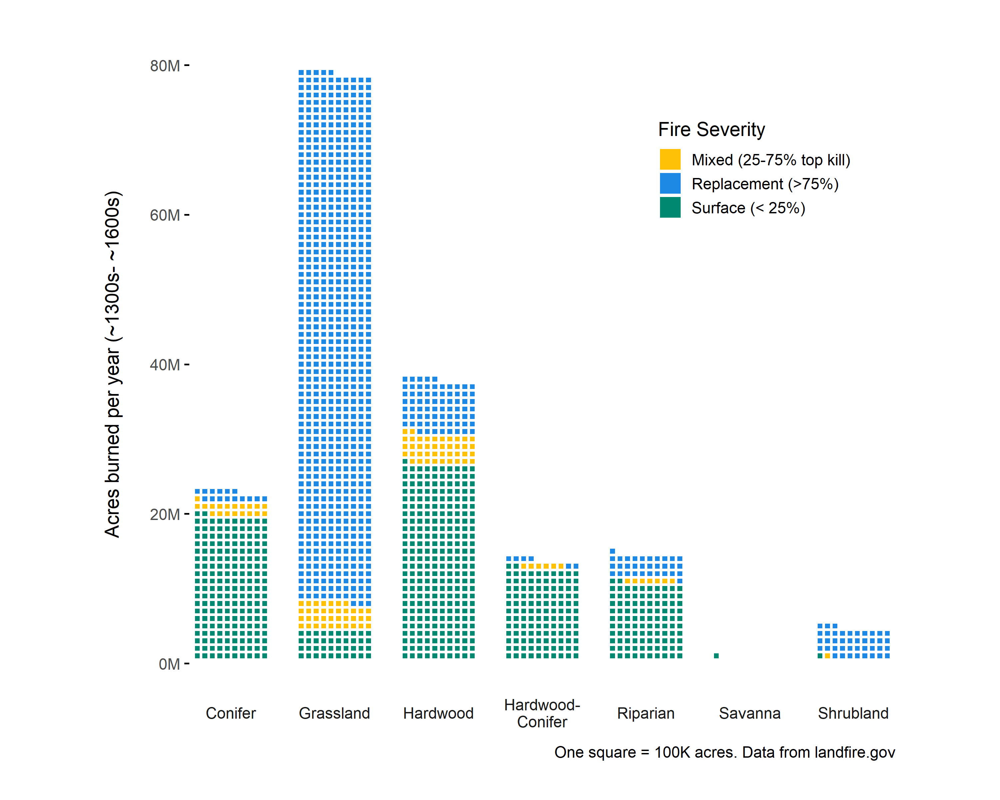

<style type="text/css"> .sidebar { overflow: auto; } </style>

    
    ```{r global, include=FALSE}

```

One burning issue.
========================================================

## blah

<font size="6"> Why we are here. </font>


```{r animatedPlotly, fig.height=6}
# insert choroMap.html URL
htmltools::tags$iframe(title = "My embedded document", src = "plotly.html", frameborder = "1", width = "90%", height="700", vspace="30")

```
<br>

<font size="6"> Before we were here-kind of.  The fall was dramatized! </font>

```{r animatedPlotlyPlay, fig.height=6}
# insert choroMap.html URL
htmltools::tags$iframe(title = "My embedded document", src = "animatedHistCurrPlay.html", frameborder = "1", width = "90%", height="700", vspace="30")

```
<br>

<font size="6"> If fire burned in squares every year-the ecosystems. </font>

```{r fireSq, fig.height=7, fig.width=10}
knitr::include_graphics("groupVegLegend.png") 
```


<br>
<font size="6"> But you said... </font>


```{r fireSqGV, fig.height=8, fig.width=11}
 
```

<font size="6"> A little about fire severity. </font>


```{r mfriMap, fig.height=8, fig.width=11}
 
```


<font size="6"> In summary </font>


```{r mfriMap, fig.height=8, fig.width=11}
 
```


Column {.sidebar}
-----------------------------------------------------------------------

### <b><font  size="4em" color="#000000">Annual acres burned has grown from ~1 M acres in 1984 to over 10M acres in 2020. <br> <br> Click the play button at the lower right to see the trend.</font></b>

<br>
This is not news for anyone in the fire business.  What is not captured here are the lives impacted, structures destroyed, habitats fundamentally altered (often beyond what fires would naturally do because of unnatural fuels buildup) and resources used in suppression.

**Question:** how do you think this compares to what would have burned in the years just prior to European colonization?

Data for the lower 48 United States from the Monitoring Trends in Burn Severity program (https://www.mtbs.gov/).  


Conversion Happens
========================================================
## blah
<font size="6"> Ecosystem conversion for the lower 48.  </font>


```{r sankey, fig.height=6}
# insert choroMap.html URL
htmltools::tags$iframe(title = "My embedded document", src = "sankeyP2.html", frameborder = "1", width = "100%", height="700", vspace="30")

```
<br>


Column {.sidebar}
-----------------------------------------------------------------------

### <b><font  size="4em" color="#000000">Hover over chart to follow patterns.</font></b>   
It's important to explore conversion as fire not only works differently from ecosystem to ecosystem, but also on developed and urban lands.  By hovering over the red Agricultural band on the right you can see that our farmlands were mostly grasslands and hardwoods historically.  Hover over the blue Grassland (past) band and you'll see what those lands are today, noting that roughly 93M acres of former grasslands are now classified as shrublands.


Historical fire by state
========================================================
## blah


<font size="6"> Historically the most fire occurred in the plains and southeast. </font>

```{r choropleth, fig.height=7}
# insert choroMap.html URL
htmltools::tags$iframe(title = "My embedded document", src = "choroMapSimple.html", frameborder = "1", width = "90%", height="700", vspace="30")

```


Column {.sidebar}
-----------------------------------------------------------------------

### <b><font  size="4em" color="#000000">There was ~172,000,000 acres of fire annually prior to European colonization</font></b>   

Prior to European colonization most of the fires were located in the central and eastern regions, and were most common in the grassland ecosystems, where replacement fires could have happened every 1-3 years.  The pine, oak and hickory forests of the east (especially the longleaf pine ecosystems of the southeast) would typically have surface fires every 5-10 years, with replacement fires being rare. 

**Hover over a state to get historical percentage burned annually by fire type.**

* Surface fire = 0-25% top kill
* Mixed fire = 26-75% top kill
* Replacement fire = 76-100% top kill

Fire and Ecosystems
=========================================================
## blah


```{r waffle, fig.height=6.5, fig.width=10}
 
```

<br>

```{r groupvegconversion map, fig.height=7, fig.width=10}
knitr::include_graphics("groupVegLegend.png") 
```


Column {.sidebar}
-----------------------------------------------------------------------

### <b><font  size="4em" color="#000000">Fire severity varied by ecosystem type</font></b>   
Ecosystems have varying levels of different fire types (aka severity; surface, mixed or replacement).  


Past vs. Present-a look by region
========================================================
## blah
<font size="6"> A look at historical fire regimes applied to modern undeveloped lands.  </font>

```{r korisMap, fig.height=8, fig.width=12}
 
```
 <br>
 <font size="6"> Map of developed and undeveloped lands.   </font>
<br>


```{r developedMap, fig.height=8, fig.width=12}
 
```

Column {.sidebar}
-----------------------------------------------------------------------

### <b><font  size="4em" color="#000000">If we were to have fires at historical rates today, not including agriculture and urban lands, we'd have more than 100 M acres per year.</font></b>   

* Sagebrush intermountain basins story
* Alaska
* What if we looked at maximum fire years?


This is a draft
=================================================================

We hope to complete and refine this dashboard to be used by the conservation community to help set the stage for conversations about fire management.  

This dashboard needs (at the least):

* data sources and methods text
* design improvement
* links to resources

