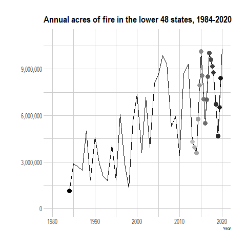

    
    ```{r global, include=FALSE}
# load data in 'global' chunk so it can be shared by all users of the dashboard
library(tigris)
library(dplyr)
library(leaflet)
library(tidyverse)
library(sf)
library(rgdal)
library(htmlwidgets)


# load data in 'global' chunk so it can be shared by all users of the dashboard
# Chord Diagram
library(chorddiag)
library(igraph)
library(readr)
library(tidygraph)

# read in data
histFireGVchord <- read_csv("data/histFireGVchord.csv")
# View(histFireGVchord)

#convert to matrix
histFireGVchordMatrix<-as.matrix(as_adjacency_matrix(as_tbl_graph(histFireGVchord),attr = "acres"))

#clean up matrix (could be cleaner!)
histFireGVchordMatrix = subset(histFireGVchordMatrix, select = -c(1:7))

histFireGVchordMatrix2 <- histFireGVchordMatrix[-c(8:10),]
```

Fire in the lower 48 states
========================================================

## Fire amounts and severity by state


```{r, fig.height=7}
# insert choroMap.html URL
htmltools::tags$iframe(title = "My embedded document", src = "choroMapFW.html", frameborder = "1", width = "100%", height="700", vspace="30")

```


Column {.sidebar}
-----------------------------------------------------------------------

### <b><font  size="4em" color="#000000">There was ~172,000,000 acres of fire annuall prior to European colonization</font></b>   

Blah Blah


Fire and Ecosystems
=========================================================

### <b><font  size="4em" color="#000000">Where the ecosystems were</font></b> 


```{r, fig.height=7, fig.width=10}
knitr::include_graphics("groupVeg.jpg") 
```


### <b><font  size="4em" color="#000000">How much fire was in each type?</font></b>  
    
```{r, fig.height=7.5, fig.width=11}


# Chord Diagram
#make a custom color pallet
groupColors <-c( "#e6e0be", # grassland OK
                 "#56bf5f", # hardwood OK
                 "#1d4220", # conifer OK
                 "#7db7c7", # riparian OK
                 "#397d3f", # hardwood-conifer OK
                 "#917e5c", # shrub
                 "#5e513a", # savana
                 "#fed98e", # surface
                 "#fe9929", # mixed
                 "#cc4c02") 
#make chord diagram
chord<-chorddiag(data = histFireGVchordMatrix2,
                 type = "bipartite",
                 groupColors = groupColors,
                 groupnamePadding = 10,
                 groupPadding = 3,
                 groupnameFontsize = 14,
                 showTicks = FALSE,
                 margin=125,
                 tooltipGroupConnector = "    &#x25B6;    ",
                 chordedgeColor = "#B3B6B7"
)
chord
```

Column {.sidebar}
-----------------------------------------------------------------------

### <b><font  size="4em" color="#000000">Fire severity varied by ecosystem type</font></b>   

Blah Blah

Recent Fire
======================================================================

<br>
<br>

```{r, fig.height=6, fig.width=6, fig.align='center'}
# add animated.gif


```


Column {.sidebar}
-----------------------------------------------------------------------

### <b><font  size="4em" color="#000000">Fire amounts are increasing</font></b>   

Blah Blah

